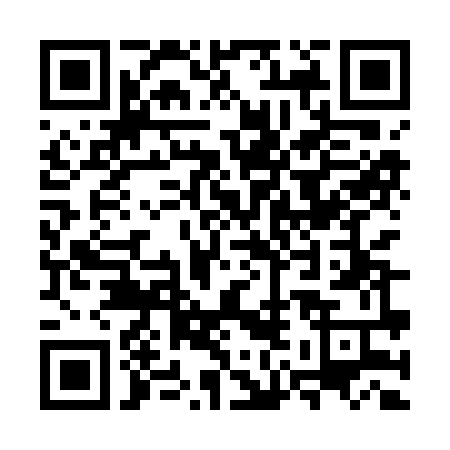

# ⚡ OptiVision | Digital Image Processing Studio (N-PECCS502P)
**Department of Computer Science and Engineering**  
**S. B. Jain Institute of Technology, Management & Research, Nagpur**[span_2](start_span)[span_2](end_span)  
*(An Autonomous Institution Affiliated to RTM Nagpur University, NAAC 'A' Accredited)*[span_3](start_span)[span_3](end_span)

---

## 🔗 Project Links
- **Live Deployment URL:** [https://image-processing-postlab-jbmubfpswzk7syvbdknj.streamlit.app](https://image-processing-postlab-jbmubfpswzk7syvbdknj.streamlit.app)
- **GitHub Repository:** [https://github.com/maviyamkhan1/image-processing-postlab](https://github.com/maviyamkhan1/image-processing-postlab)

---

## 📱 Mobile Access (Scan to Launch)
Scan the QR code below to access the live web portal directly on your mobile device:

  

---

## 🚀 Key Platform Features
- **Zero-Friction Benchmarks:** Built-in standard test images (Shapes, High-Contrast Grids, Document Text, and Gradients) for immediate testing without local uploads.
- **Hardware Integration:** Live webcam snapshot capture for instant real-time filtering and edge analysis.
- **Quality Metrics Engine:** Quantitative reconstruction evaluation using Mean Squared Error (MSE) and Peak Signal-to-Noise Ratio (PSNR in dB).
- **Three-Tier Architecture:** Dedicated tabs for **Interactive Processing**, **Mathematical Theory & Formulation**, and **Viva Voce & Discussion Questions** for all experiments.

---

## 🧪 Implemented Experiments Curriculum

### Core Practicals (Practicals 1–5)
- **Practical 01: Environment Setup & Matrix Profiling**[span_4](start_span)[span_4](end_span)  
  Initialization of Python/OpenCV ecosystem, image loading, coordinate geometry verification, and single-plane channel extraction[span_5](start_span)[span_5](end_span).
- **Practical 02: Dual-Image Arithmetics & Bitwise Logic Gates**[span_6](start_span)[span_6](end_span)  
  Weighted signal blending ($cv2.addWeighted$), direct subtraction, and Boolean logic (AND, OR, NOT, XOR) for digital masking[span_7](start_span)[span_7](end_span).
- **Practical 03: 2-D Geometric Transformations & Affine Warping**[span_8](start_span)[span_8](end_span)  
  Affine matrix transformations: Translation, Center Rotation, Scaling, Reflection (Flipping), Shearing, and Region of Interest (ROI) Cropping[span_9](start_span)[span_9](end_span).
- **Practical 04: Spatial Enhancements & Equalization**[span_10](start_span)[span_10](end_span)  
  Linear dynamic scaling (Alpha/Beta), Histogram Equalization with 256-bin Matplotlib intensity plots, and multi-mode Thresholding (Binary, Truncate, ToZero, Otsu)[span_11](start_span)[span_11](end_span).
- **Practical 05: Spatial Domain Filtering & Smoothing**[span_12](start_span)[span_12](end_span)  
  Neighborhood 2D convolutions: Averaging (Mean), Gaussian Bell Curve, Median Filtering (Impulse/Salt & Pepper noise suppression), and Bilateral Filtering (Edge-preserving)[span_13](start_span)[span_13](end_span).

### Advanced Practicals (Practicals 6–9)
- **Practical 06: Image Restoration & Inpainting**[span_14](start_span)[span_14](end_span)  
  Degradation modeling, synthetic damage generation, and missing-pixel reconstruction using the Fast Marching (Telea) and Navier-Stokes (Fluid Dynamics) methods[span_15](start_span)[span_15](end_span).
- **Practical 07: Lossless vs Lossy Image Compression**[span_16](start_span)[span_16](end_span)  
  Compression ratio analysis comparing variable-quality JPEG (quantization loss) with Deflate-based PNG (lossless entropy preservation)[span_17](start_span)[span_17](end_span).
- **Practical 08: Morphological Operations & Topological Slicing**[span_18](start_span)[span_18](end_span)  
  Set-theoretic binary operations: Erosion, Dilation, Opening, Closing, and Morphological Gradient with contour area detection[span_19](start_span)[span_19](end_span).
- **Practical 09: Object Detection via Normalized Cross-Correlation**[span_20](start_span)[span_20](end_span)  
  Sliding-window template matching via `cv2.matchTemplate` using Normalized Cross-Correlation (NCC) and peak threshold detection[span_21](start_span)[span_21](end_span).

### Post-Laboratory Modules
- **Post-Lab 02: Advanced Color Space Conversions**[span_22](start_span)[span_22](end_span)  
  Transformation between RGB, HSV, YCrCb, and CIELAB color spaces with individual chromatic and luminance channel decompositions[span_23](start_span)[span_23](end_span).
- **Post-Lab 03: Comparative Edge Detection (Canny vs Sobel vs Prewitt)**[span_24](start_span)[span_24](end_span)  
  Comparative boundary analysis between first-order directional gradient kernels (Sobel, Prewitt) and multi-stage Canny edge detection with non-maximum suppression and hysteresis[span_25](start_span)[span_25](end_span).

---

## 🛠️ Technology Stack
- **Web UI & Reactive Server:** Streamlit[span_26](start_span)[span_26](end_span)
- **Computer Vision Engine:** OpenCV (`opencv-python-headless`)[span_27](start_span)[span_27](end_span)[span_28](start_span)[span_28](end_span)
- **Array Computing & Linear Algebra:** NumPy[span_29](start_span)[span_29](end_span)[span_30](start_span)[span_30](end_span)
- **Image Pipeline:** Pillow (PIL)[span_31](start_span)[span_31](end_span)
- **Data Plotting:** Matplotlib[span_32](start_span)[span_32](end_span)[span_33](start_span)[span_33](end_span)
- **Hosting Infrastructure:** Streamlit Community Cloud
- **Version Control:** Git & GitHub[span_34](start_span)[span_34](end_span)
-
